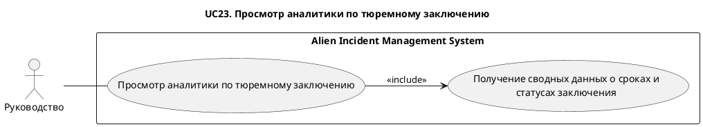

# UC23. Просмотр аналитики по тюремному заключению

## Диаграмма прецедента

```plantuml
@startuml
title UC23. Просмотр аналитики по тюремному заключению
left to right direction

actor "Руководство" as Management

rectangle "Alien Incident Management System" {

(Просмотр аналитики по тюремному заключению) as UC11

(Получение сводных данных о сроках и\nстатусах заключения) as UC113

}

Management -- UC11

UC11 --> UC113 : <<include>>

@enduml
```
