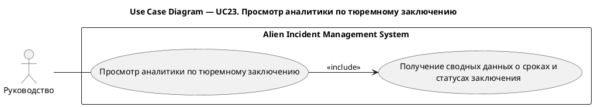
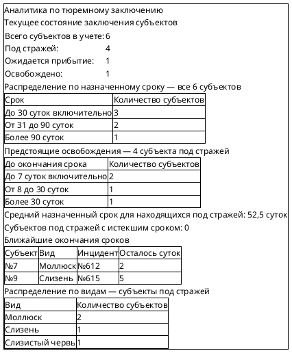
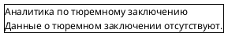

# UC23. Просмотр аналитики по тюремному заключению

## 1.Use-Case Name (Название прецедента)

UC23. Просмотр аналитики по тюремному заключению.

Связанные требования: 3.1.5.3.

## 2.Actors (Акторы)

Основное действующее лицо: Руководство.

## 2. Brief Description (Краткое описание)

Руководство обращается к аналитике по тюремному заключению и получает сводные данные о сроках и статусах заключения
субъектов для контроля их содержания.

## 3. Flow of Events (Последовательность событий)

### 3.1 Basic Flow (Главная последовательность)

1. Представитель руководства открывает аналитику по тюремному заключению.
2. Система формирует и отображает сводные данные о сроках и статусах заключения субъектов.
3. Пользователь просматривает полученные сведения.

### 3.2 Alternative Flows (Альтернативные последовательности)

Данные о тюремном заключении отсутствуют

1. Альтернативный поток начинается на шаге 2 основного потока.
2. Система сообщает об отсутствии данных о тюремном заключении.
3. Пользователь просматривает результат. Прецедент завершается.

## 4. Preconditions (Предусловия)

1. Пользователь авторизован в системе.
2. Пользователь является представителем руководства организации.

## 5. Postconditions (Постусловия)

Отсутствуют.

## 6. Extension Points (Точки расширения)

Отсутствуют.

## 7. Use-case diagram (Диаграмма прецедента)

## 8. Interface example (Пример интерефейса)

