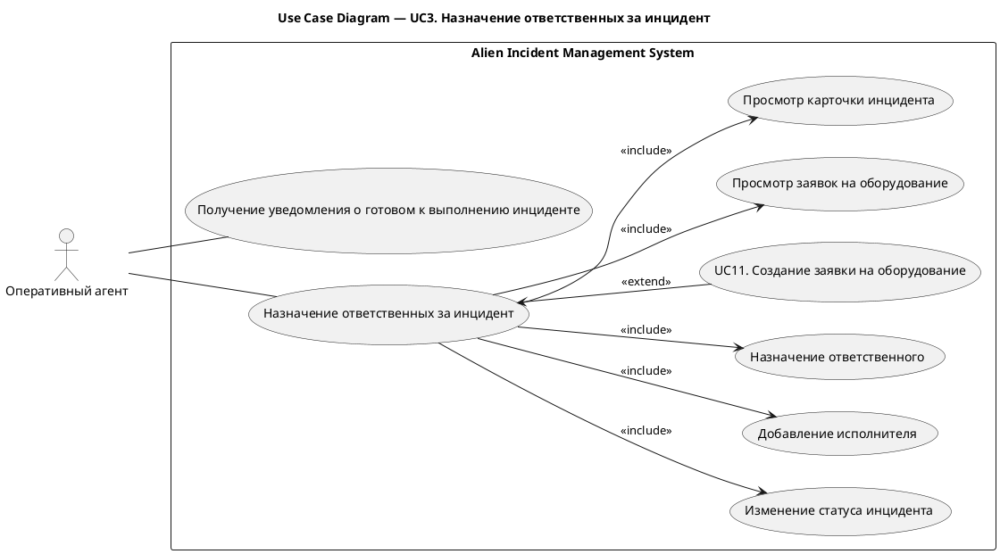
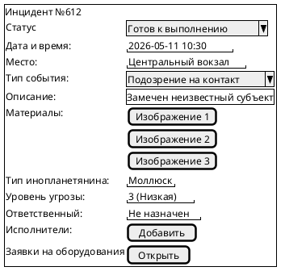
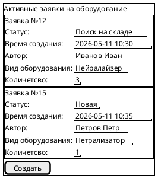

# UC3. Назначение ответственных за инцидент

## 1.Use-Case Name (Название прецедента)

UC3. Назначение ответственных за инцидент.

Связанные требования: 3.1.1.2, 3.1.1.3, 3.1.3.1

## 2.Actors (Акторы)

Основное действующее лицо: Оперативный агент.

## 2. Brief Description (Краткое описание)

Оперативный агент получает инцидент, готовый к выполнению, анализирует информацию, назначает ответственного и
исполнителей, проверяет обеспеченность оборудованием и переводит инцидент в статус выполнения.

## 3. Flow of Events (Последовательность событий)

### 3.1 Basic Flow (Главная последовательность)

1. Оперативный агент получает уведомление о новом инциденте в статусе «Готов к выполнению».
2. Оперативный агент открывает карточку инцидента.
3. Агент изучает описание инцидента, материалы, результаты анализа.
4. Агент переводит инцидент в статус «Подготовка к выполнению».
5. Агент просматривает существующие заявки на оборудование, связанные с инцидентом.
6. Агент анализирует достаточность оборудования для выполнения операции.
7. Точка расширения: [создание заявки на оборудование (UC11)](UC11.md).
8. Агент назначает ответственного за выполнение операции.
9. Пока агент считает, что исполнителей для выполнения операции недостаточно:
   1. Агент добавляет исполнителя операции из числа сотрудников.
   2. Система добавляет исполнителя к инциденту.
   3. Система уведомляет сотрудника о назначении исполнителем.
10. Агент переводит инцидент в статус «Подготовлен к выполнению».
11. Система сохраняет изменения.
12. Система фиксирует запись в истории изменений инцидента.
13. Система отправляет уведомления ответственному и исполнителям.

### 3.2 Alternative Flows (Альтернативные последовательности)

Недостаточно данных для выполнения операции

1. Альтернативный поток начинается после шага 3 основного потока.
2. Агент определяет, что информации по инциденту недостаточно.
3. Если недостаточно первичных данных об инциденте:
   1. Агент изменяет статус инцидента на «Требуется уточнение».
   2. Агент добавляет комментарий с описанием недостающих данных.
   3. Система уведомляет оператора мониторинга о необходимости уточнения.
4. Если недостаточно данных анализа об инциденте:
   1. Агент изменяет статус инцидента на «Требуется доанализ».
   2. Агент добавляет комментарий с описанием недостающих данных.
   3. Система уведомляет аналитика-ксенобиолога о необходимости уточнения.
5. Выполнение прецедента завершается.

## 4. Preconditions (Предусловия)

1. Пользователь авторизован в системе.
2. Пользователь имеет роль Оперативный агент.
3. В системе существует инцидент в статусе «Готов к выполнению».
4. Инцидент содержит результаты аналитической обработки.

## 5. Postconditions (Постусловия)

1. Для инцидента назначен ответственный.
2. Для инцидента назначены исполнители.
3. Созданы необходимые заявки на оборудование.
4. Инцидент переведен в статус «Подготовлен к выполнению».
5. Исполнители уведомлены о назначении.
6. История изменений обновлена.

## 6. Extension Points (Точки расширения)

[UC11 Создание заявки на оборудование](UC11.md).

## 7. Use-case diagram (Диаграмма прецедента)

## 8. Interface example (Пример интерефейса)

```plantuml
@startsalt
{ 
    Поиск сотрудника
    {
        "иван"
        Найдено 2 совпадения:
        {+
            "Иванов Иван"
        }
        {+
            "Петров Иван"
        }
    }
}
@endsalt
```

