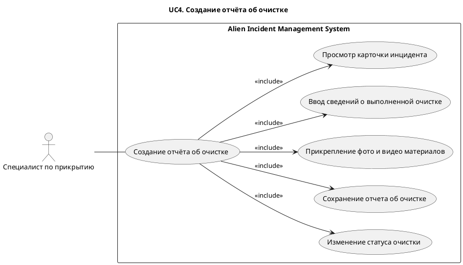
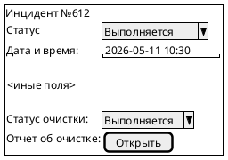
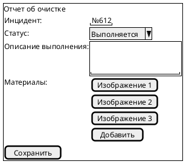

# Создание отчёта об очистке

## Диаграмма прецедента



## Пример интерефейса





## Генерация диаграмм

```bash
curl -L https://github.com/plantuml/plantuml/releases/latest/download/plantuml.jar -o /tmp/plantuml.jar
mkdir -p /tmp/aims-uc4-use-case-render

# Проверка синтаксиса
java -Djava.awt.headless=true -jar /tmp/plantuml.jar -checkonly docs/use-case/UC4.md

# SVG
java -Djava.awt.headless=true -jar /tmp/plantuml.jar -tsvg -o /tmp/aims-uc4-use-case-render docs/use-case/UC4.md

# PNG
java -Djava.awt.headless=true -jar /tmp/plantuml.jar -tpng -o /tmp/aims-uc4-use-case-render docs/use-case/UC4.md
```
