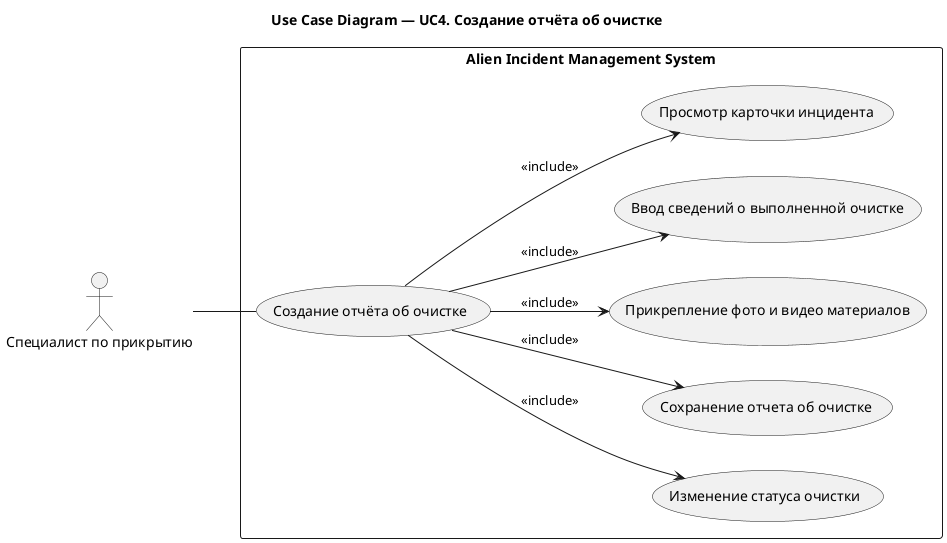
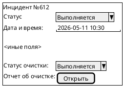
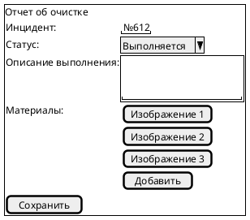

# UC4. Создание отчёта об очистке

## 1.Use-Case Name (Название прецедента)

UC4. Создание отчета об очистке.

Связанные требования: 3.1.6.1, 3.1.6.2

## 2.Actors (Акторы)

Основное действующее лицо: Специалист по прикрытию.

## 2. Brief Description (Краткое описание)

После завершения мероприятий по устранению следов инцидента специалист по прикрытию создает отчет об очистке,
описывает выполненные действия, прикрепляет материалы с места проведения операции и сохраняет отчет в системе.

## 3. Flow of Events (Последовательность событий)

### 3.1 Basic Flow (Главная последовательность)

1. Специалист по прикрытию завершает мероприятия по очистке последствий инцидента.
2. Специалист открывает карточку инцидента.
3. Специалист инициирует создание отчета об очистке.
4. Система отображает форму создания отчета.
5. Специалист указывает сведения о выполненной очистке: описание выполненных действий; использованные методы;
   информацию об устраненных последствиях.
6. Специалист прикрепляет фото- и видеоматериалы с места проведения очистки.
7. Специалист инициирует сохранение отчета.
8. Система выполняет проверку корректности заполнения данных.
9. Система сохраняет отчет об очистке.
10. Система фиксирует запись в истории изменений инцидента.
11. Специалист изменяет статус очистки на «Очистка завершена».
12. Система уведомляет ответственного агента за инцидент о завершении очистки.

### 3.2 Alternative Flows (Альтернативные последовательности)

Введены некорректные данные

1. Альтернативный поток начинается после шага 8 основного потока.
2. Система обнаруживает ошибки заполнения.
3. Система отображает сообщение об ошибке.
4. Специалист исправляет данные.
5. Выполнение возвращается к шагу 8 основной последовательности.

## 4. Preconditions (Предусловия)

1. Пользователь авторизован в системе.
2. Пользователь обладает ролью Специалист по прикрытию.
3. В системе существует инцидент в статусе выполнения.
4. Мероприятия по очистке завершены.

## 5. Postconditions (Постусловия)

1. Отчет об очистке сохранен в системе.
2. К отчету прикреплены материалы очистки.
3. История изменений инцидента обновлена.
4. Статус очистки изменен на «Очистка завершена».
5. Ответственный оперативный агент уведомлен о завершении работ.

## 6. Extension Points (Точки расширения)

Отсутствуют.

## 7. Use-case diagram (Диаграмма прецедента)

```plantuml
@startuml
title Use Case Diagram — UC4. Создание отчёта об очистке
left to right direction

actor "Специалист по прикрытию" as Cleaner

rectangle "Alien Incident Management System" {

(Создание отчёта об очистке) as UC11

(Изменение статуса очистки) as UC115
(Сохранение отчета об очистке) as UC114
(Прикрепление фото и видео материалов) as UC113
(Ввод сведений о выполненной очистке) as UC112
(Просмотр карточки инцидента) as UC111

}

Cleaner -- UC11

UC11 --> UC111 : <<include>>
UC11 --> UC112 : <<include>>
UC11 --> UC113 : <<include>>
UC11 --> UC114 : <<include>>
UC11 --> UC115 : <<include>>

@enduml
```

## 8. Interface example (Пример интерефейса)

```plantuml
@startsalt
{+ 
    Инцидент №612
    {
        Статус | ^ Выполняется ^
        Дата и время: | "2026-05-11 10:30"
        {
            .
            <иные поля>
            .
        }
        Статус очистки: | ^Выполняется^
        Отчет об очистке: | [ Открыть ]
    }
}
@endsalt
```

```plantuml
@startsalt
{+ 
    Отчет об очистке
    {
        Инцидент: | "№612"
        Статус: | ^Выполняется^
        Описание выполнения: {+
            .
            .
            "                  "
        }
        Материалы: | {
            [Изображение 1]
            [Изображение 2]
            [Изображение 3]
            [ Добавить ]
        }
    }
    [ Сохранить ]
}
@endsalt
```
