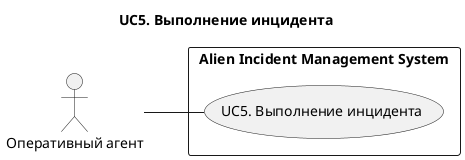

# UC5. Выполнение инцидента

```plantuml
@startuml
title UC5. Выполнение инцидента
left to right direction

actor "Оперативный агент" as Agent

rectangle "Alien Incident Management System" {
  usecase "UC5. Выполнение инцидента" as UC5
}

Agent -- UC5

@enduml
```
