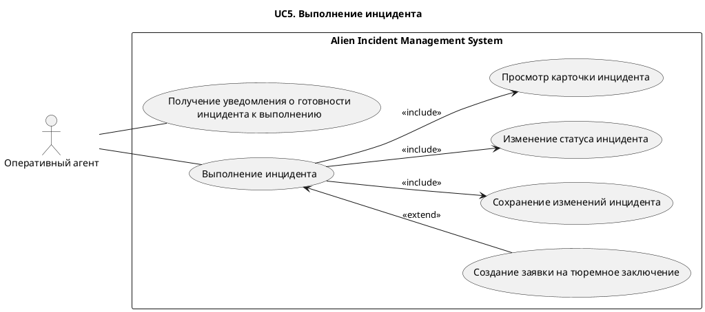

# UC5. Выполнение инцидента

## Диаграмма прецедента

```plantuml
@startuml
title UC5. Выполнение инцидента
left to right direction

actor "Оперативный агент" as Agent

rectangle "Alien Incident Management System" {

(Получение уведомления о готовности\nинцидента к выполнению) as UC01

(Выполнение инцидента) as UC11

(Создание заявки на тюремное заключение) as UC115
(Сохранение изменений инцидента) as UC114
(Изменение статуса инцидента) as UC113
(Просмотр карточки инцидента) as UC111

}

Agent -- UC01

Agent -- UC11

UC11 --> UC111 : <<include>>
UC11 --> UC113 : <<include>>
UC11 --> UC114 : <<include>>
UC11 <-- UC115 : <<extend>>

@enduml
```
