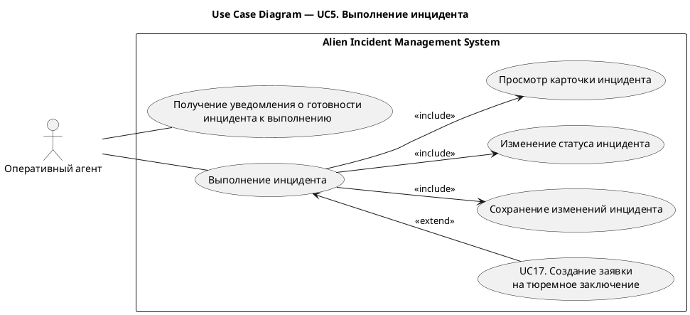
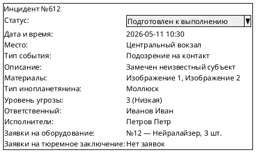
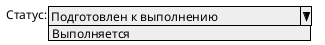
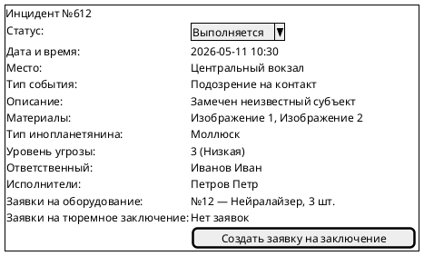

# UC5. Выполнение инцидента

## 1.Use-Case Name (Название прецедента)

UC5. Выполнение инцидента.

Связанные требования: 3.1.1.2, 3.1.5.1.

## 2.Actors (Акторы)

Основное действующее лицо: Оперативный агент.

## 2. Brief Description (Краткое описание)

Оперативный агент получает уведомление о готовности инцидента к выполнению и отмечает начало выполнения операции. При
необходимости агент создает заявку на тюремное заключение субъекта.

## 3. Flow of Events (Последовательность событий)

### 3.1 Basic Flow (Главная последовательность)

1. Оперативный агент получает уведомление о готовности инцидента к выполнению.
2. Агент открывает карточку инцидента в статусе «Подготовлен к выполнению».
3. Агент знакомится с информацией об инциденте и подготовке операции.
4. Агент изменяет статус инцидента на «Выполняется».
5. Система сохраняет изменения.
6. Система фиксирует запись в истории изменений инцидента.
7. Агент приступает к выполнению оперативных мероприятий.
8. Точка расширения: [создание заявки на тюремное заключение (UC17)](UC17.md).

### 3.2 Alternative Flows (Альтернативные последовательности)

Отсутствуют.

## 4. Preconditions (Предусловия)

1. Пользователь авторизован в системе.
2. Пользователь имеет роль Оперативный агент.
3. Пользователь назначен ответственным за инцидент.
4. Инцидент находится в статусе «Подготовлен к выполнению».
5. Для инцидента назначены исполнители.

## 5. Postconditions (Постусловия)

1. Инцидент находится в статусе «Выполняется».
2. Начало выполнения зафиксировано в истории изменений инцидента.
3. При необходимости создана связанная с инцидентом заявка на тюремное заключение.

## 6. Extension Points (Точки расширения)

[UC17. Создание заявки на тюремное заключение](UC17.md) — шаг 8 основной последовательности.

## 7. Use-case diagram (Диаграмма прецедента)

## 8. Interface example (Пример интерефейса)

