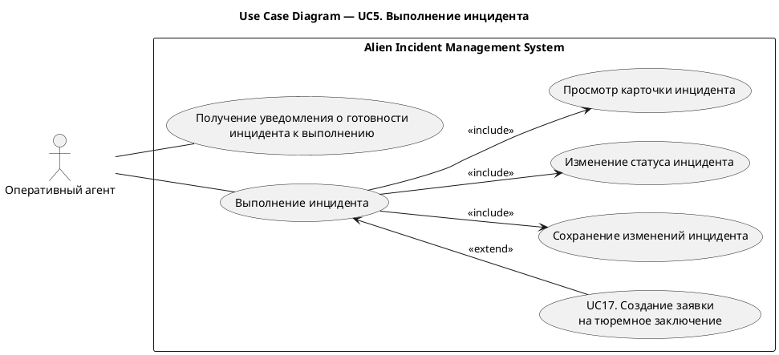

# UC5. Выполнение инцидента

## 1.Use-Case Name (Название прецедента)

UC5. Выполнение инцидента.

Связанные требования: 3.1.1.2, 3.1.5.1.

## 2.Actors (Акторы)

Основное действующее лицо: Оперативный агент.

## 2. Brief Description (Краткое описание)

Оперативный агент получает уведомление о готовности инцидента к выполнению и отмечает начало выполнения операции. При
необходимости агент создает заявку на тюремное заключение субъекта.

## 3. Flow of Events (Последовательность событий)

### 3.1 Basic Flow (Главная последовательность)

TBD

### 3.2 Alternative Flows (Альтернативные последовательности)

TBD

## 4. Preconditions (Предусловия)

TBD

## 5. Postconditions (Постусловия)

TBD

## 6. Extension Points (Точки расширения)

TBD

## 7. Use-case diagram (Диаграмма прецедента)

## 8. Interface example (Пример интерефейса)

TBD
