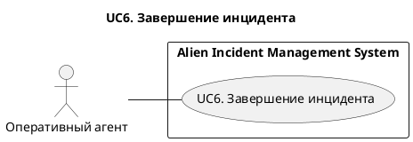

# UC6. Завершение инцидента

```plantuml
@startuml
title UC6. Завершение инцидента
left to right direction

actor "Оперативный агент" as Agent

rectangle "Alien Incident Management System" {
  usecase "UC6. Завершение инцидента" as UC6
}

Agent -- UC6

@enduml
```
