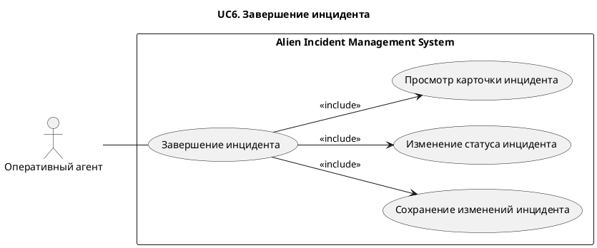

# UC6. Завершение инцидента

## Диаграмма прецедента

```plantuml
@startuml
title UC6. Завершение инцидента
left to right direction

actor "Оперативный агент" as Agent

rectangle "Alien Incident Management System" {

(Завершение инцидента) as UC11

(Сохранение изменений инцидента) as UC115
(Изменение статуса инцидента) as UC114
(Просмотр карточки инцидента) as UC111

}

Agent -- UC11

UC11 --> UC111 : <<include>>
UC11 --> UC114 : <<include>>
UC11 --> UC115 : <<include>>

@enduml
```
