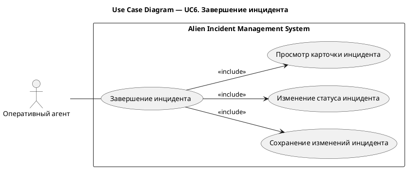
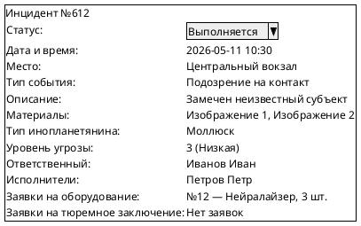
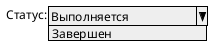
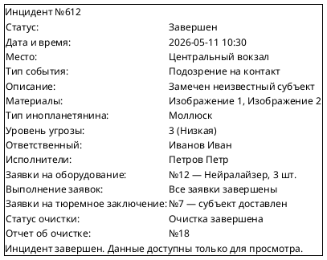

# UC6. Завершение инцидента

## 1.Use-Case Name (Название прецедента)

UC6. Завершение инцидента.

Связанные требования: 3.1.1.2.

## 2.Actors (Акторы)

Основное действующее лицо: Оперативный агент.

## 2. Brief Description (Краткое описание)

После выполнения оперативных мероприятий оперативный агент отмечает завершение работы по инциденту и сохраняет
результат в системе.

## 3. Flow of Events (Последовательность событий)

### 3.1 Basic Flow (Главная последовательность)

1. Оперативный агент завершает оперативные мероприятия по инциденту.
2. Агент открывает карточку инцидента в статусе «Выполняется».
3. Агент инициирует изменение статуса инцидента на «Завершен».
4. Система проверяет, что все связанные с инцидентом заявки на оборудование завершены.
5. Система сохраняет статус «Завершен».
6. Система фиксирует запись в истории изменений инцидента.
7. Система отображает карточку завершенного инцидента без возможности изменения данных.

### 3.2 Alternative Flows (Альтернативные последовательности)

Есть незавершенные заявки на оборудование

1. Альтернативный поток начинается на шаге 4 основного потока.
2. Система обнаруживает хотя бы одну незавершенную заявку на оборудование, связанную с инцидентом.
3. Система сообщает, что завершение инцидента невозможно.
4. Прецедент завершается.

## 4. Preconditions (Предусловия)

1. Пользователь авторизован в системе.
2. Пользователь имеет роль Оперативный агент.
3. Пользователь назначен ответственным за инцидент.
4. Инцидент находится в статусе «Выполняется».
5. Оперативные мероприятия по инциденту завершены.

## 5. Postconditions (Постусловия)

При успешном завершении:

1. Все связанные с инцидентом заявки на оборудование завершены.
2. Инцидент находится в статусе «Завершен».
3. Завершение инцидента зафиксировано в истории изменений.
4. Данные завершенного инцидента доступны только для просмотра.

При наличии незавершенных заявок:

1. Инцидент остается в статусе «Выполняется».
2. Данные инцидента остаются доступными для изменения.

## 6. Extension Points (Точки расширения)

Отсутствуют.

## 7. Use-case diagram (Диаграмма прецедента)

## 8. Interface example (Пример интерефейса)

