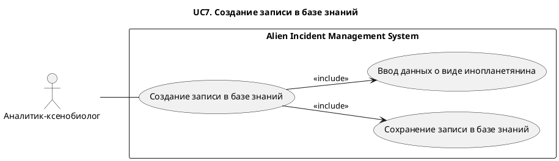

# UC7. Создание записи в базе знаний

## Диаграмма прецедента

```plantuml
@startuml
title UC7. Создание записи в базе знаний
left to right direction

actor "Аналитик-ксенобиолог" as Analyst

rectangle "Alien Incident Management System" {

(Создание записи в базе знаний) as UC11

(Сохранение записи в базе знаний) as UC114
(Ввод данных о виде инопланетянина) as UC111

}

Analyst -- UC11

UC11 --> UC111 : <<include>>
UC11 --> UC114 : <<include>>

@enduml
```
