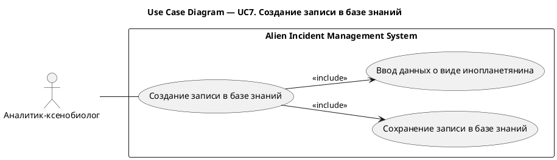
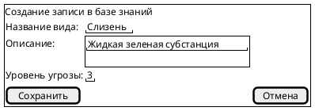

# UC7. Создание записи в базе знаний

## 1.Use-Case Name (Название прецедента)

UC7. Создание записи в базе знаний.

Связанные требования: 3.1.2.1.

## 2.Actors (Акторы)

Основное действующее лицо: Аналитик-ксенобиолог.

## 2. Brief Description (Краткое описание)

Аналитик-ксенобиолог при необходимости регистрации нового вида инопланетян инициирует создание записи в базе знаний,
указывает название вида и его характеристики и сохраняет запись для дальнейшего использования.

## 3. Flow of Events (Последовательность событий)

### 3.1 Basic Flow (Главная последовательность)

1. Аналитик-ксенобиолог определяет необходимость добавления нового вида инопланетян в базу знаний.
2. Аналитик инициирует создание записи в базе знаний.
3. Система отображает форму создания записи.
4. Аналитик указывает название вида, его описание и уровень угрозы.
5. Аналитик инициирует сохранение записи.
6. Система выполняет проверку корректности введенных данных.
7. Система сохраняет новую запись в базе знаний.
8. Система отображает созданную запись.

### 3.2 Alternative Flows (Альтернативные последовательности)

Введены некорректные данные

1. Альтернативный поток начинается после шага 6 основного потока.
2. Система обнаруживает ошибки заполнения и сообщает о них аналитику.
3. Аналитик исправляет данные.
4. Выполнение возвращается к шагу 5 основной последовательности.

## 4. Preconditions (Предусловия)

1. Пользователь авторизован в системе.
2. Пользователь обладает ролью Аналитик-ксенобиолог.
3. Аналитик располагает сведениями о добавляемом виде инопланетян.

## 5. Postconditions (Постусловия)

1. В базе знаний создана запись о виде инопланетян.
2. Запись содержит название вида, описание и уровень угрозы.
3. Запись доступна для поиска и последующей привязки к инцидентам.

## 6. Extension Points (Точки расширения)

Отсутствуют.

## 7. Use-case diagram (Диаграмма прецедента)

## 8. Interface example (Пример интерефейса)

