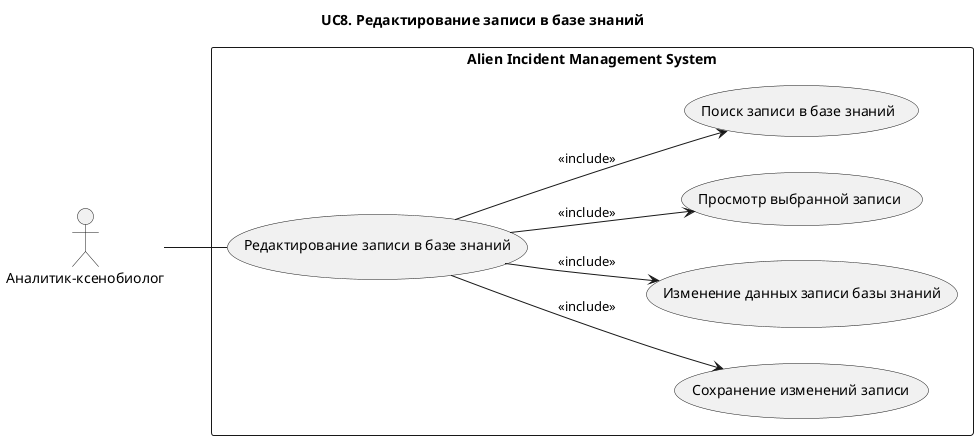

# UC8. Редактирование записи в базе знаний

## Диаграмма прецедента

```plantuml
@startuml
title UC8. Редактирование записи в базе знаний
left to right direction

actor "Аналитик-ксенобиолог" as Analyst

rectangle "Alien Incident Management System" {

(Редактирование записи в базе знаний) as UC11

(Сохранение изменений записи) as UC115
(Изменение данных записи базы знаний) as UC113
(Просмотр выбранной записи) as UC112
(Поиск записи в базе знаний) as UC111

}

Analyst -- UC11

UC11 --> UC111 : <<include>>
UC11 --> UC112 : <<include>>
UC11 --> UC113 : <<include>>
UC11 --> UC115 : <<include>>

@enduml
```
