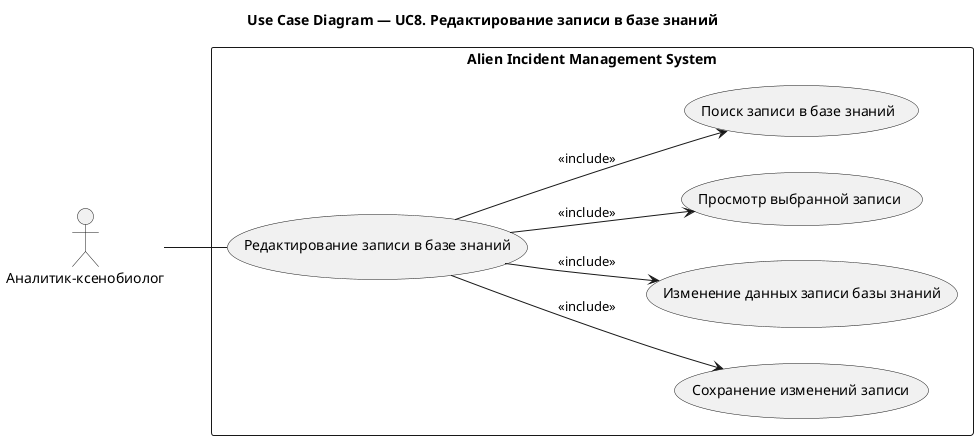

# UC8. Редактирование записи в базе знаний

## 1.Use-Case Name (Название прецедента)

UC8. Редактирование записи в базе знаний.

Связанные требования: 3.1.2.2, 3.1.2.3.

## 2.Actors (Акторы)

Основное действующее лицо: Аналитик-ксенобиолог.

## 2. Brief Description (Краткое описание)

Аналитик-ксенобиолог при необходимости уточнения сведений о виде инопланетян находит запись в базе знаний,
просматривает ее, изменяет данные и сохраняет обновленную запись.

## 3. Flow of Events (Последовательность событий)

### 3.1 Basic Flow (Главная последовательность)

TBD

### 3.2 Alternative Flows (Альтернативные последовательности)

TBD

## 4. Preconditions (Предусловия)

TBD

## 5. Postconditions (Постусловия)

TBD

## 6. Extension Points (Точки расширения)

TBD

## 7. Use-case diagram (Диаграмма прецедента)

## 8. Interface example (Пример интерефейса)

TBD
