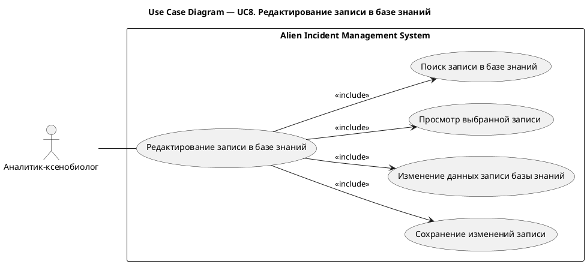
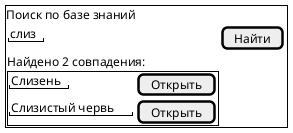
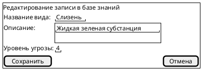

# UC8. Редактирование записи в базе знаний

## 1.Use-Case Name (Название прецедента)

UC8. Редактирование записи в базе знаний.

Связанные требования: 3.1.2.2, 3.1.2.3.

## 2.Actors (Акторы)

Основное действующее лицо: Аналитик-ксенобиолог.

## 2. Brief Description (Краткое описание)

Аналитик-ксенобиолог при необходимости уточнения сведений о виде инопланетян находит запись в базе знаний,
просматривает ее, изменяет данные и сохраняет обновленную запись.

## 3. Flow of Events (Последовательность событий)

### 3.1 Basic Flow (Главная последовательность)

1. Аналитик-ксенобиолог определяет необходимость уточнения сведений о виде инопланетян.
2. Аналитик инициирует поиск записи в базе знаний.
3. Система отображает результаты поиска.
4. Аналитик выбирает запись для редактирования.
5. Система отображает сведения о выбранном виде.
6. Аналитик изменяет название вида, описание или уровень угрозы.
7. Аналитик инициирует сохранение изменений.
8. Система выполняет проверку корректности введенных данных.
9. Система сохраняет изменения записи в базе знаний.
10. Система отображает обновленную запись.

### 3.2 Alternative Flows (Альтернативные последовательности)

Введены некорректные данные

1. Альтернативный поток начинается после шага 8 основного потока.
2. Система обнаруживает ошибки заполнения и сообщает о них аналитику.
3. Аналитик исправляет данные.
4. Выполнение возвращается к шагу 7 основной последовательности.

Нужная запись не найдена

1. Альтернативный поток начинается после шага 3 основного потока.
2. Аналитик уточняет условия поиска.
3. Выполнение возвращается к шагу 2 основной последовательности.

## 4. Preconditions (Предусловия)

1. Пользователь авторизован в системе.
2. Пользователь обладает ролью Аналитик-ксенобиолог.
3. В базе знаний существует запись, сведения которой требуется уточнить.

## 5. Postconditions (Постусловия)

1. Изменения записи сохранены в базе знаний.
2. При просмотре и поиске записи доступны обновленные сведения о виде.

## 6. Extension Points (Точки расширения)

Отсутствуют.

## 7. Use-case diagram (Диаграмма прецедента)

## 8. Interface example (Пример интерефейса)

