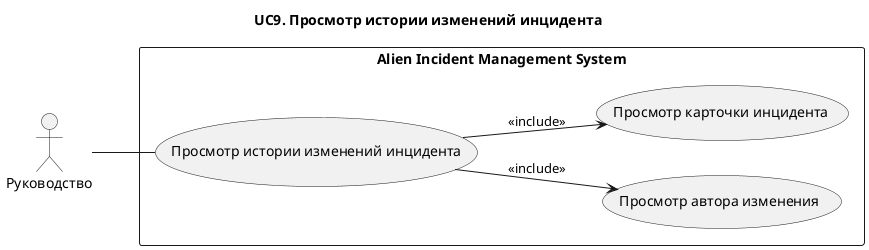

# UC9. Просмотр истории изменений инцидента

## Диаграмма прецедента

```plantuml
@startuml
title UC9. Просмотр истории изменений инцидента
left to right direction

actor "Руководство" as Management

rectangle "Alien Incident Management System" {

(Просмотр истории изменений инцидента) as UC11

(Просмотр автора изменения) as UC113
(Просмотр карточки инцидента) as UC111

}

Management -- UC11

UC11 --> UC111 : <<include>>
UC11 --> UC113 : <<include>>

@enduml
```
