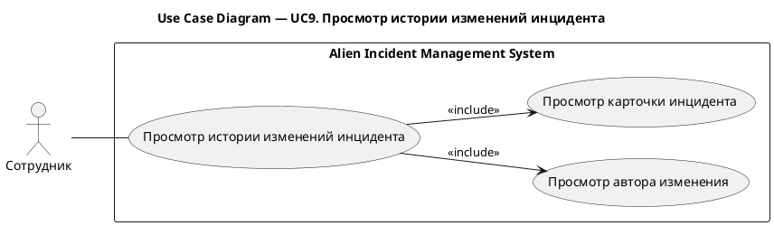
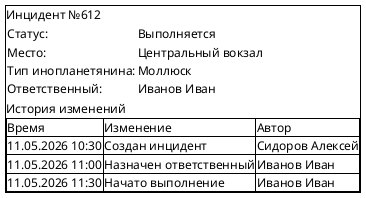

# UC9. Просмотр истории изменений инцидента

## 1.Use-Case Name (Название прецедента)

UC9. Просмотр истории изменений инцидента.

Связанные требования: 3.1.1.4.

## 2.Actors (Акторы)

Основное действующее лицо: Сотрудник.

## 2. Brief Description (Краткое описание)

Сотрудник открывает карточку инцидента и просматривает историю его изменений, включая время изменения и сведения о
пользователе, внесшем изменение, для анализа хода обработки инцидента.

## 3. Flow of Events (Последовательность событий)

### 3.1 Basic Flow (Главная последовательность)

1. Сотрудник открывает карточку инцидента.
2. Система отображает сведения об инциденте и историю его изменений.
3. Сотрудник просматривает изменения с указанием времени и пользователя, внесшего изменение.

### 3.2 Alternative Flows (Альтернативные последовательности)

Отсутствуют.

## 4. Preconditions (Предусловия)

1. Пользователь авторизован в системе.
2. Пользователь является сотрудником организации.

## 5. Postconditions (Постусловия)

Отсутствуют.

## 6. Extension Points (Точки расширения)

Отсутствуют.

## 7. Use-case diagram (Диаграмма прецедента)

## 8. Interface example (Пример интерефейса)

