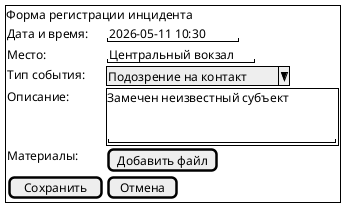
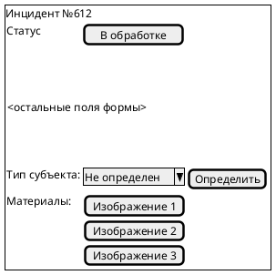
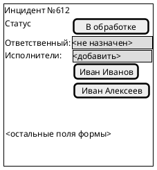
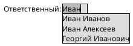

# Создание инцидента

```plantuml
@startsalt
{+ 
    Форма регистрации инцидента
    {
        Дата и время: | "2026-05-11 10:30"
        Место: | "Центральный вокзал"
        Тип события: | ^Подозрение на контакт^
        Описание: | {+
           Замечен неизвестный субъект
           .
           "                            "
        }
        Материалы: | [Добавить файл]
        
        [ Сохранить ] | [ Отмена ]
    }
}
@endsalt
```

```plantuml
@startsalt
{+ 
    Инцидент №612
    {
        Статус | [ В обработке ]
        {
            .
            .
            .
            <остальные поля формы> 
            .
            .
            .
        } | *
        Тип субъекта: | {
            ^Не определен^ | [Определить]
        }
        Материалы: | {
            [Изображение 1]
            [Изображение 2]
            [Изображение 3]
        }
    }
}
@endsalt
```

```plantuml
@startsalt
{+ 
    Инцидент №612
    {
        Статус | [ В обработке ]
        Ответственный: | {* <не назначен> }
        Исполнители: | {
            {* <добавить> }
            [Иван Иванов]
            [Иван Алексеев]
        }
        {
            .
            .
            <остальные поля формы> 
            .
            .
        } | *
    }
}
@endsalt
```

```plantuml
@startsalt
{ 
    Ответственный: | {* Иван
      Иван | Иван Иванов | Иван Алексеев | Георгий Иванович }
}
@endsalt
```
