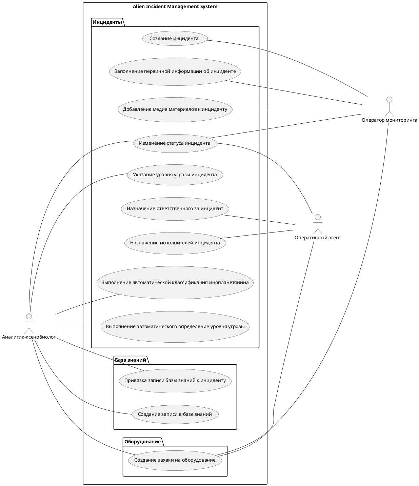

# Регистрация и подготовка инцидента

```plantuml
@startuml
left to right direction

actor "Оператор мониторинга" as Operator
actor "Аналитик-ксенобиолог" as Analyst
actor "Оперативный агент" as Agent

rectangle "Alien Incident Management System" {

package "Инциденты" {

(Создание инцидента) as UC11
(Заполнение первичной информации об инциденте) as UC12
(Добавление медиа материалов к инциденту) as UC13
(Изменение статуса инцидента) as UC14
(Указание уровня угрозы инцидента) as UC15
(Назначение ответственного за инцидент) as UC16
(Назначение исполнителей инцидента) as UC17

(Выполнение автоматической классификация инопланетянина) as UC18
(Выполнение автоматического определение уровня угрозы) as UC19

}

package "База знаний" {

(Привязка записи базы знаний к инциденту) as UC21
(Создание записи в базе знаний) as UC22

}

package "Оборудование" {

(Создание заявки на оборудование) as UC31

}

}

UC11 ---- Operator
UC12 -- Operator
UC13 -- Operator
UC14 -- Operator
UC31 -- Operator

Analyst --- UC14
Analyst -- UC15
Analyst -- UC18
Analyst -- UC19
Analyst -- UC21
Analyst -- UC22
Analyst -- UC31

UC14 --- Agent
UC16 -- Agent
UC17 -- Agent
UC31 -- Agent

@enduml
```
