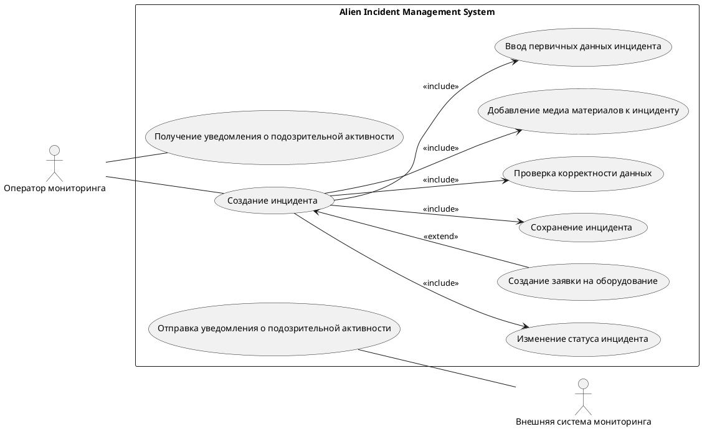

# Регистрация и подготовка инцидента

```plantuml
@startuml
left to right direction

actor "Оператор мониторинга" as Operator
actor "Внешняя система мониторинга" as ExternalMonitoring

rectangle "Alien Incident Management System" {

(Отправка уведомления о подозрительной активности) as UC01
(Получение уведомления о подозрительной активности) as UC02

(Создание инцидента) as UC11

(Изменение статуса инцидента) as UC116
(Создание заявки на оборудование) as UC115
(Сохранение инцидента) as UC114
(Проверка корректности данных) as UC113
(Добавление медиа материалов к инциденту) as UC112
(Ввод первичных данных инцидента) as UC111

}

UC01 -- ExternalMonitoring
Operator -- UC02

Operator -- UC11

UC11 --> UC111 : <<include>>
UC11 --> UC112 : <<include>>
UC11 --> UC113 : <<include>>
UC11 --> UC114 : <<include>>
UC11 <-- UC115 : <<extend>>
UC11 --> UC116 : <<include>>

@enduml
```
