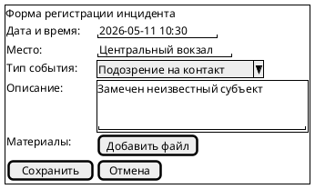

# Создание инцидента

```plantuml
@startsalt
{+ 
    Форма регистрации инцидента
    {
        Дата и время: | "2026-05-11 10:30"
        Место: | "Центральный вокзал"
        Тип события: | ^Подозрение на контакт^
        Описание: | {+
           Замечен неизвестный субъект
           .
           "                            "
        }
        Материалы: | [Добавить файл]
        
        [ Сохранить ] | [ Отмена ]
    }
}
@endsalt
```
