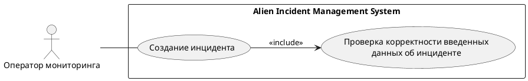

# Создание инцидента

```plantuml
@startuml
left to right direction

actor "Оператор мониторинга" as Operator

rectangle "Alien Incident Management System" {

(Создание инцидента) as UC33
(Проверка корректности введенных\nданных об инциденте) as UC331

}

Operator -- UC33
UC33 --> UC331 : <<include>>

@enduml
```
