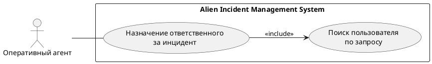

# Создание инцидента

```plantuml
@startuml
left to right direction

actor "Оперативный агент" as Agent

rectangle "Alien Incident Management System" {

(Назначение ответственного\nза инцидент) as UC13
(Поиск пользователя\nпо запросу) as UC131

}

Agent -- UC13
UC13 --> UC131 : <<include>>

@enduml
```
