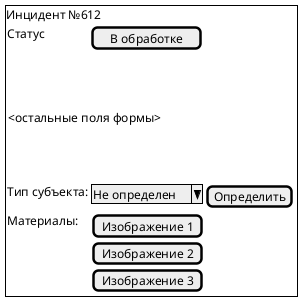
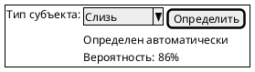

# Выполнение автоматической классификация инопланетянина

```plantuml
@startsalt
{+ 
    Инцидент №612
    {
        Статус | [ В обработке ]
        {
            .
            .
            .
            <остальные поля формы> 
            .
            .
            .
        } | *
        Тип субъекта: | {
            ^Не определен^ | [Определить]
        }
        Материалы: | {
            [Изображение 1]
            [Изображение 2]
            [Изображение 3]
        }
    }
}
@endsalt
```

```plantuml
@startsalt
{+ 
    {
        Тип субъекта: | {
            ^Слизь    ^ | [Определить]
            Определен автоматически | *
            Вероятность: 86% | *
        }
    }
}
@endsalt
```
