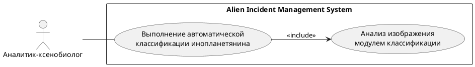

# Выполнение автоматической классификация инопланетянина

```plantuml
@startuml
left to right direction

actor "Аналитик-ксенобиолог" as Analyst

rectangle "Alien Incident Management System" {

(Выполнение автоматической\nклассификации инопланетянина) as UC16
(Анализ изображения\nмодулем классификации) as UC161

}

Analyst -- UC16

UC16 --> UC161 : <<include>>

@enduml
```
