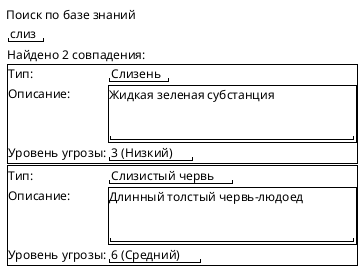
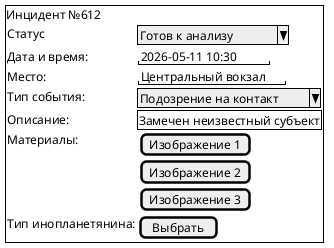
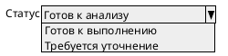

# Создание инцидента

```plantuml
@startsalt
{ 
    Поиск по базе знаний
    {
        "слиз"
        Найдено 2 совпадения:
        {+
            Тип: | "Слизень"
            Описание: | {+
               Жидкая зеленая субстанция
               .
               "                              "
            }
            Уровень угрозы: | "3 (Низкий)"
        }
        {+
            Тип: | "Слизистый червь"
            Описание: | {+
               Длинный толстый червь-людоед
               .
               "                              "
            }
            Уровень угрозы: | "6 (Средний)"
        }
    }
}
@endsalt
```

```plantuml
@startsalt
{+ 
    Инцидент №612
    {
        Статус | ^ Готов к анализу ^
        Дата и время: | "2026-05-11 10:30"
        Место: | "Центральный вокзал"
        Тип события: | ^Подозрение на контакт^
        Описание: | {+
           Замечен неизвестный субъект
        }
        Материалы: | {
            [Изображение 1]
            [Изображение 2]
            [Изображение 3]
        }
        Тип инопланетянина: | [ Выбрать ]
    }
}
@endsalt
```

```plantuml
@startsalt
{ 
    Статус | ^Готов к анализу       ^^ Готов к выполнению ^^ Требуется уточнение ^
}
@endsalt
```
