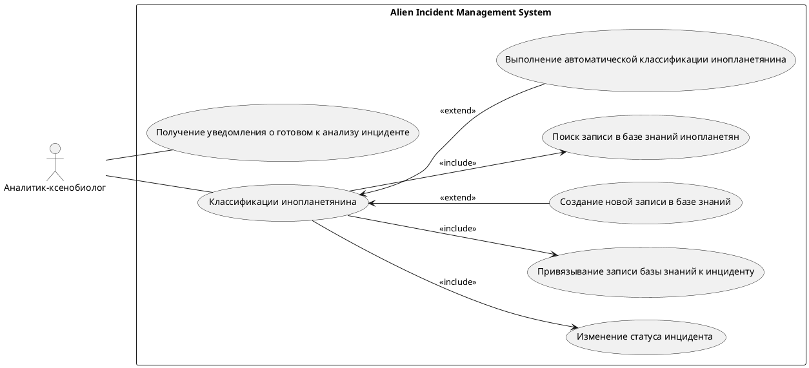

# Регистрация и подготовка инцидента

```plantuml
@startuml
left to right direction

actor "Аналитик-ксенобиолог" as Analyst

rectangle "Alien Incident Management System" {

(Получение уведомления о готовом к анализу инциденте) as UC01

(Классификации инопланетянина) as UC11

(Изменение статуса инцидента) as UC115
(Привязывание записи базы знаний к инциденту) as UC114
(Создание новой записи в базе знаний) as UC113
(Поиск записи в базе знаний инопланетян) as UC112
(Выполнение автоматической классификации инопланетянина) as UC111

}

Analyst -- UC01

Analyst -- UC11

UC11 <-- UC111 : <<extend>>
UC11 --> UC112 : <<include>>
UC11 <-- UC113 : <<extend>>
UC11 --> UC114 : <<include>>
UC11 --> UC115 : <<include>>

@enduml
```
