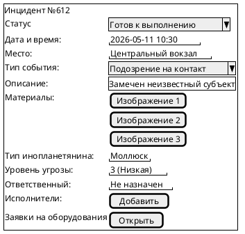
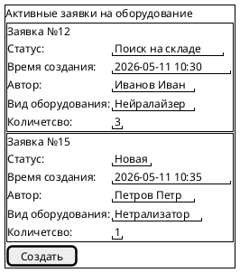

# Создание инцидента

```plantuml
@startsalt
{+ 
    Инцидент №612
    {
        Статус | ^ Готов к выполнению ^
        Дата и время: | "2026-05-11 10:30"
        Место: | "Центральный вокзал"
        Тип события: | ^Подозрение на контакт^
        Описание: | {+
           Замечен неизвестный субъект
        }
        Материалы: | {
            [Изображение 1]
            [Изображение 2]
            [Изображение 3]
        }
        Тип инопланетянина: | "Моллюск"
        Уровень угрозы: | "3 (Низкая)"
        Ответственный: | "Не назначен"
        Исполнители: | [ Добавить ]
        Заявки на оборудования | [ Открыть ]
    }
}
@endsalt
```

```plantuml
@startsalt
{ 
    Поиск сотрудника
    {
        "иван"
        Найдено 2 совпадения:
        {+
            "Иванов Иван"
        }
        {+
            "Петров Иван"
        }
    }
}
@endsalt
```

```plantuml
@startsalt
{+
    Активные заявки на оборудование
    {
        {+
            Заявка №12
            Статус: | "Поиск на складе"
            Время создания: | "2026-05-11 10:30"
            Автор: | "Иванов Иван"
            Вид оборудования: | "Нейралайзер"
            Количетсво: | "3"
        }
        {+
            Заявка №15
            Статус: | "Новая"
            Время создания: | "2026-05-11 10:35"
            Автор: | "Петров Петр"
            Вид оборудования: | "Нетрализатор"
            Количетсво: | "1"
        }
    }
    [ Создать ]
}
@endsalt
```
