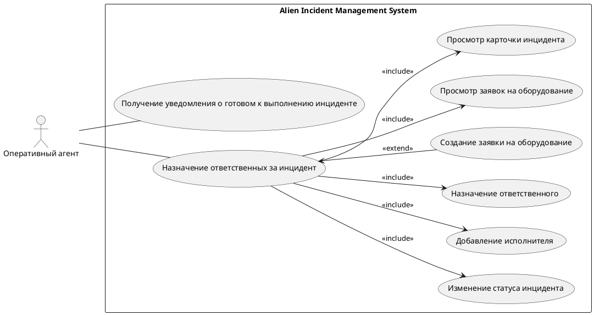

# Регистрация и подготовка инцидента

```plantuml
@startuml
left to right direction

actor "Оперативный агент" as Agent

rectangle "Alien Incident Management System" {

(Получение уведомления о готовом к выполнению инциденте) as UC01

(Назначение ответственных за инцидент) as UC11

(Изменение статуса инцидента) as UC116
(Добавление исполнителя) as UC115
(Назначение ответственного) as UC114
(Создание заявки на оборудование) as UC113
(Просмотр заявок на оборудование) as UC112
(Просмотр карточки инцидента) as UC111

}

Agent -- UC01

Agent -- UC11

UC11 --> UC111 : <<include>>
UC11 --> UC112 : <<include>>
UC11 <-- UC113 : <<extend>>
UC11 --> UC114 : <<include>>
UC11 --> UC115 : <<include>>
UC11 --> UC116 : <<include>>

@enduml
```
