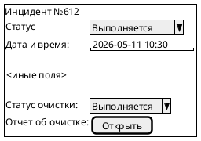
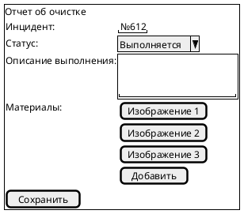

# Создание инцидента

```plantuml
@startsalt
{+ 
    Инцидент №612
    {
        Статус | ^ Выполняется ^
        Дата и время: | "2026-05-11 10:30"
        {
            .
            <иные поля>
            .
        }
        Статус очистки: | ^Выполняется^
        Отчет об очистке: | [ Открыть ]
    }
}
@endsalt
```

```plantuml
@startsalt
{+ 
    Отчет об очистке
    {
        Инцидент: | "№612"
        Статус: | ^Выполняется^
        Описание выполнения: {+
            .
            .
            "                  "
        }
        Материалы: | {
            [Изображение 1]
            [Изображение 2]
            [Изображение 3]
            [ Добавить ]
        }
    }
    [ Сохранить ]
}
@endsalt
```
