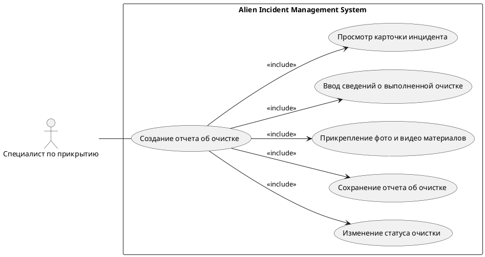

# Регистрация и подготовка инцидента

```plantuml
@startuml
left to right direction

actor "Специалист по прикрытию" as Cleaner

rectangle "Alien Incident Management System" {

(Создание отчета об очистке) as UC11

(Изменение статуса очистки) as UC115
(Сохранение отчета об очистке) as UC114
(Прикрепление фото и видео материалов) as UC113
(Ввод сведений о выполненной очистке) as UC112
(Просмотр карточки инцидента) as UC111

}

Cleaner -- UC11

UC11 --> UC111 : <<include>>
UC11 --> UC112 : <<include>>
UC11 --> UC113 : <<include>>
UC11 --> UC114 : <<include>>
UC11 --> UC115 : <<include>>

@enduml
```
